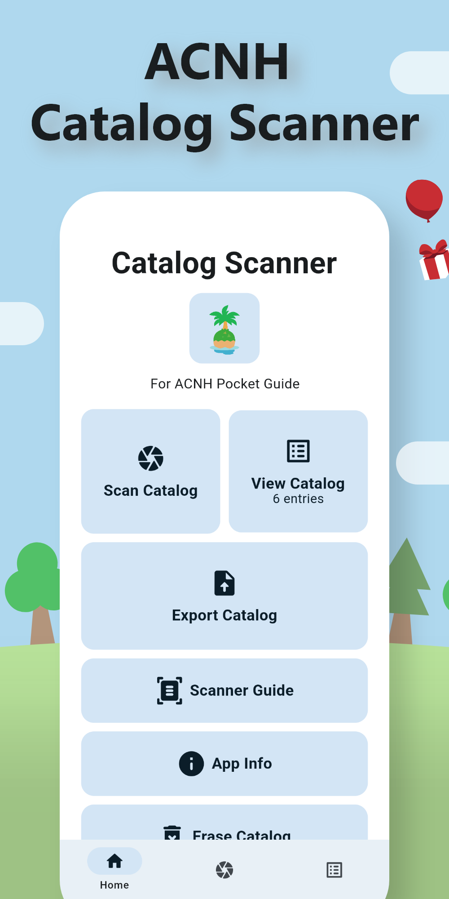
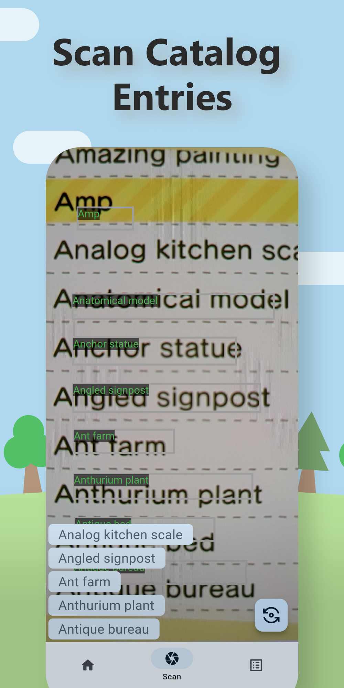

<h1 align="center" style="font-size:28px; line-height:1"><b>Catalog Scanner For ACNH Pocket Guide</b></h1>

| 1,400+ Downloads |
| :-------------: |

<a href="https://play.google.com/store/apps/details?id=com.acnh.catalog_scanner">
  

    
  

</a>
<a href="https://play.google.com/store/apps/details?id=com.acnh.catalog_scanner">
  

    
  

</a>

## Technologies
* [Google ML Kit](https://developers.google.com/ml-kit)
* [Flutter](https://flutter.dev/)
* [Dart](https://dart.dev/)

## Overview
ACNH Catalog allows users to quickly and easily scan their in-game catalog using their phone's camera. The app uses Google's ML Kit to accurately identify and recognize text in the catalog, making it easy to import into ACNH Pocket Guide.

The app is built using Flutter and Dart and follows Material Design guidelines to ensure the app looks modern and intuitive.

Under the hood, a `Set` database is used to ensure fast lookup times with O(1) complexity. This means that searching for items that exist when scanned is quick and efficient, without any delays. Especially since text recognition uses a lot of compute.

To use the app, simply open it and point a phone's camera at your in-game catalog. The app will automatically detect the text and allow users to import it into ACNH Pocket Guide with just a few taps.

In addition to the core functionality of scanning and importing catalogs, this app also offers users the ability to view and delete catalog entries.

## Images
Can be seen here: https://play.google.com/store/apps/details?id=com.acnh.catalog_scanner or below
|  |  | 
| ------------- | ------------- |
|  |  |
